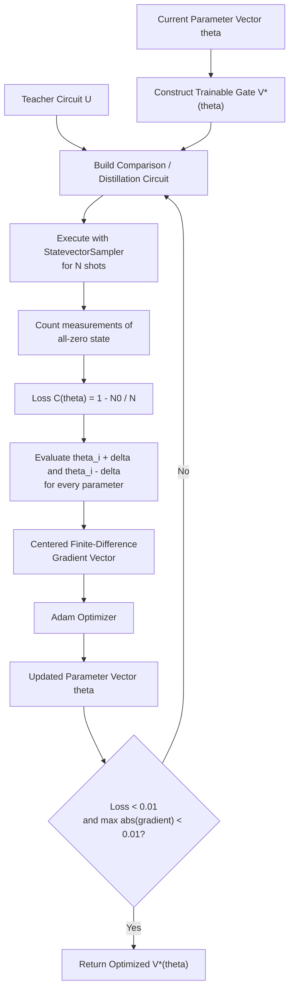

# Quantum Assisted Quantum Compilation (QAQC)

> This is my own implementation of the algorithm detailed in Khatri et al. (2019).

## Executive Overview

Quantum-Assisted Quantum Compilation (QAQC) can be viewed as a **teacher–student circuit distillation problem**. A fixed target circuit, $U$, defines the operation that I want to reproduce, while a parameterized circuit, $V(\theta)$, is restricted to a smaller hardware-oriented gate set and trained to reproduce the same behavior.

The implementation is therefore split into two interacting systems:

1. **Quantum evaluation** — construct a comparison circuit containing both $U$ and $V^*(\theta)$, execute it for a finite number of shots, and convert the probability of measuring the all-zero state into a loss.
2. **Classical optimization** — estimate how that loss changes with respect to every component of $\theta$, then use Adam to update the complete parameter vector.

The quantum computer is not directly deciding how the ansatz should change. Its role is to return an experimentally measurable score for the current candidate circuit. The optimizer then uses repeated evaluations of that score to move $V(\theta)$ toward the target operation.

---

## Understanding and Interpretation

### 1. Target circuit and trainable circuit

The implementation distinguishes between two circuits:

- **$U$ — teacher circuit:** the ideal circuit that defines the operation I want to compile.
- **$V(\theta)$ — trainable circuit:** the hardware-oriented approximation whose rotation angles are optimized.

In the current example, $U$ is a two-qubit Bell-state preparation circuit:

$$
|00\rangle
\;\xrightarrow{\,H\otimes I\,}\;
\frac{|00\rangle+|10\rangle}{\sqrt{2}}
\;\xrightarrow{\,CX_{0\rightarrow1}\,}\;
\frac{|00\rangle+|11\rangle}{\sqrt{2}}.
$$

The ansatz $V(\theta)$ is built from the reduced gate set

$$
\{R_Z,\; SX,\; CZ\}.
$$

The goal of this choice is to keep the trainable circuit close to gates that map naturally onto IBM-style hardware rather than allowing the optimizer to select from an unrestricted collection of abstract gates.

### 2. Structure of $V(\theta)$

`trainableGate()` constructs three repeated layers. For every qubit, each layer applies

$$
R_Z(\theta_i)\;SX\;R_Z(\theta_{i+1})\;SX\;R_Z(\theta_{i+2}).
$$

This means that each qubit contributes **three trainable scalar parameters per layer**. With $L=3$ layers and $n$ qubits,

$$
P = 3nL = 9n
$$

trainable parameters are used. The current two-qubit example therefore contains

$$
P = 18
$$

components in the parameter vector

$$
\theta = (\theta_0,\theta_1,\ldots,\theta_{17}).
$$

The fixed `SX` gates provide the non-$Z$ rotations needed to make the surrounding trainable `RZ` angles expressive. Between the first and second, and second and third, single-qubit layers, the current implementation inserts `CZ` entangling gates. For the present two-qubit example this produces one `CZ(0,1)` entangler at each of those boundaries.

Writing each single-qubit layer as $L_k(\theta)$ and each `CZ` entangling layer as $E_k$, the three-layer structure is

$$
V(\theta)
=
L_3(\theta)\,E_2\,L_2(\theta)\,E_1\,L_1(\theta).
$$

After constructing $V(\theta)$, `trainableGate()` returns `ansatz.to_gate().inverse().reverse_ops()`. For the current symmetric gate set $\{R_Z,\;SX,\;CZ\}$, this produces

$$
V^*(\theta),
$$

which is the form applied to the trainable register in the comparison circuit.

Before the trainable gate is constructed for the comparison circuit, every component of $\theta$ is reduced modulo $2\pi$. This keeps the numerical representation of the rotation angles bounded without changing the periodic action of the corresponding rotations.

### 3. Quantum comparison / distillation circuit

`distillationCircuit()` uses **twice as many physical qubits as the teacher circuit**. If $U$ acts on $n$ qubits, the comparison circuit acts on $2n$ qubits divided into a teacher register and a trainable register.

The circuit first creates Bell-pair correlations between the two registers:

1. Apply $H$ to every qubit in the first register.
2. Apply `CX(i, i+n)` from each teacher-register qubit to its partner in the second register.
3. Apply $U$ to the first register.
4. Apply $V^*(\theta)$ to the second register.
5. Undo the Bell-pair preparation with the inverse `CX` sequence followed by $H$ gates.
6. Measure all $2n$ qubits.

In circuit form, the comparison follows

$$
\begin{aligned}
|0\rangle^{\otimes 2n}
&\xrightarrow{\,H^{\otimes n}\otimes I^{\otimes n}\,}
\xrightarrow{\,\prod_{i=0}^{n-1} CX_{i,i+n}\,}
\xrightarrow{\,U\otimes V^*(\theta)\,} \\
&\xrightarrow{\,\prod_{i=0}^{n-1} CX_{i,i+n}\,}
\xrightarrow{\,H^{\otimes n}\otimes I^{\otimes n}\,}
\text{measure}.
\end{aligned}
$$

The implementation treats the frequency of the all-zero outcome as its circuit-similarity signal. If $N_0$ is the number of all-zero measurements and $N$ is the total number of shots, then

$$
p_0(\theta) \approx \frac{N_0}{N}.
$$

The loss is defined as

$$
C(\theta) = 1-p_0(\theta)
          = 1-\frac{N_0}{N}.
$$

Therefore:

- $C(\theta) \rightarrow 0$ means the comparison circuit is increasingly concentrated on the all-zero outcome.
- Larger values of $C(\theta)$ mean the current ansatz is producing a weaker match under the comparison circuit implemented here.

Although `StatevectorSampler` is used, the score is deliberately obtained from **finite-shot counts**, so the optimizer sees a sampled objective rather than an exact analytic probability.

### 4. Gradient estimation

The circuit itself is not differentiated by TensorFlow. Instead, every component of $\theta$ is differentiated numerically with a centered finite difference.

For parameter $\theta_i$,

$$
\frac{\partial C}{\partial \theta_i}
\approx
\frac{C(\theta+\delta e_i)-C(\theta-\delta e_i)}{2\delta},
$$

where $e_i$ selects only the $i$-th component of the parameter vector.

The current implementation uses

$$
\delta = 0.1.
$$

For every parameter, two new comparison circuits are therefore evaluated:

- one at $\theta_i+\delta$,
- one at $\theta_i-\delta$.

These scalar derivatives are collected into the full gradient vector

$$
\nabla C(\theta)
=
\left(
\frac{\partial C}{\partial \theta_0},
\frac{\partial C}{\partial \theta_1},
\ldots,
\frac{\partial C}{\partial \theta_{P-1}}
\right).
$$

This is important because Adam receives the **entire gradient vector together with the entire $\theta$ vector**. It does not optimize each gate independently. Each parameter receives its own gradient history and adaptive step size while remaining part of a single coupled optimization problem.

### 5. Adam update

The gradient vector is passed to TensorFlow's Adam optimizer with a learning rate of

$$
\eta = 0.01.
$$

Adam maintains moving estimates of the first and second moments of each component of the gradient. The practical effect in this implementation is that the raw finite-difference derivative is not used as a fixed gradient-descent step. Adam instead scales the update for each component of $\theta$ according to its recent gradient behavior.

### 6. Training loop and stopping condition

The current run begins with every trainable angle initialized to

$$
\theta_i = \frac{\pi}{2}.
$$

The principal hyperparameters are:

| Parameter | Current value | Role |
| --- | ---: | --- |
| Ansatz layers | `3` | Repeated trainable circuit depth |
| Parameters per qubit per layer | `3` | Three trainable `RZ` angles |
| Finite-difference shift $\delta$ | `0.1` | Numerical gradient displacement |
| Adam learning rate | `0.01` | Optimizer step scale |
| Shots per circuit evaluation | `24,000` | Sampling precision of each loss estimate |
| Loss threshold | `0.01` | Required objective value for convergence |
| Gradient threshold | `0.01` | Required maximum absolute gradient component |
| Configured epoch threshold | `10,000` | Fallback termination bound |

Training continues until both

$$
C(\theta) < 0.01
$$

and

$$
\max_i\left|\frac{\partial C}{\partial\theta_i}\right| < 0.01.
$$

Using the maximum absolute gradient component is intentionally stricter than looking only at the mean gradient or the gradient norm: the loop stops only after **every individual parameter derivative** lies below the gradient threshold.

### 7. Cost of one epoch

If the ansatz contains $P$ trainable parameters, one epoch performs:

- one circuit evaluation for the current loss, and
- two circuit evaluations for each parameter to construct the centered finite-difference gradient.

Therefore the number of circuit evaluations per epoch is

$$
1+2P.
$$

For the current two-qubit, three-layer ansatz,

$$
P=18 \quad\Rightarrow\quad 1+2P=37
$$

circuit evaluations per epoch. At `24,000` shots per evaluation, the implementation requests `888,000` sampled shots during a complete 18-parameter epoch.

This is one of the central computational tradeoffs of the current design: the finite-difference gradient is simple and transparent, but its quantum-evaluation cost grows linearly with the number of trainable parameters.

---

## Code Structure

### `trainableGate(bit_count, theta)`

Constructs the parameterized student circuit $V(\theta)$ and returns $V^*(\theta)$ for use in the comparison circuit.

**Responsibilities:**

- creates a three-layer ansatz;
- consumes the components of the full `theta` vector sequentially;
- places three trainable `RZ` gates on each qubit per layer;
- places fixed `SX` gates between those rotations;
- inserts `CZ` entanglement between trainable layers;
- converts the resulting `QuantumCircuit` into the $V^*(\theta)$ gate returned to the comparison circuit.

### `distillationCircuit(teacher_circuit, ansatz)`

Constructs the $2n$-qubit circuit used to compare $U$ and $V(\theta)$ through $U$ and $V^*(\theta)$.

**Responsibilities:**

- prepares Bell-pair correlations between two $n$-qubit registers;
- applies the teacher circuit to the first register;
- wraps the trainable parameters modulo $2\pi$;
- constructs and applies $V^*(\theta)$ to the second register;
- reverses the Bell preparation;
- measures the complete system.

### `loss(zero_count, shots_per_epoch)`

Converts the observed all-zero frequency into the scalar objective

$$
C = 1-\frac{N_0}{N}.
$$

### `runEpoch(distillationCircuit, shots_per_epoch)`

Executes one supplied comparison circuit using `StatevectorSampler`, extracts the measurement counts, constructs the correct `"00...0"` key for the circuit size, and returns the resulting loss.

### `calculateGradient(diff, delta)`

Evaluates one centered finite-difference derivative from the forward and backward loss values:

$$
\frac{C_+-C_-}{2\delta}.
$$

### `printTrainingStatus(...)`

Reports diagnostics after every optimizer update:

- current epoch;
- current loss;
- Euclidean gradient norm;
- mean absolute gradient;
- maximum absolute gradient;
- index of the parameter with the largest absolute gradient;
- magnitude of the Adam parameter update.

These values separate three different questions during training: **how good the circuit currently is, how much optimization signal remains, and how far Adam actually moved the parameter vector.**

### `__main__`

Coordinates the complete training procedure shown in the execution-flow diagram in the Executive Overview.

---

## Current Implementation Boundary

This README documents the behavior of the implementation as it currently exists. In particular, `distillationCircuit()` applies $U$ directly to the first register and $V^*(\theta)$ to the second register, then uses the all-zero probability after uncomputing the Bell preparation as the optimization signal.

That convention should be kept explicit when comparing this program mathematically against the exact global cost construction in Khatri et al. The code overview above describes **what this implementation computes** rather than silently assuming that every register-side transformation is identical to the notation used in the paper.

The optimizer is also presently based on a sampled centered finite difference rather than an analytic derivative or parameter-shift rule. This makes the optimization logic straightforward to inspect, but means that deeper or wider ansätze increase the number of circuit evaluations required in every epoch.

---

## Work Cited

**Khatri, S., LaRose, R., Poremba, A., Cincio, L., Sornborger, A. T., & Coles, P. J. (2019). _Quantum-assisted quantum compiling_. Quantum, 3, 140.**

